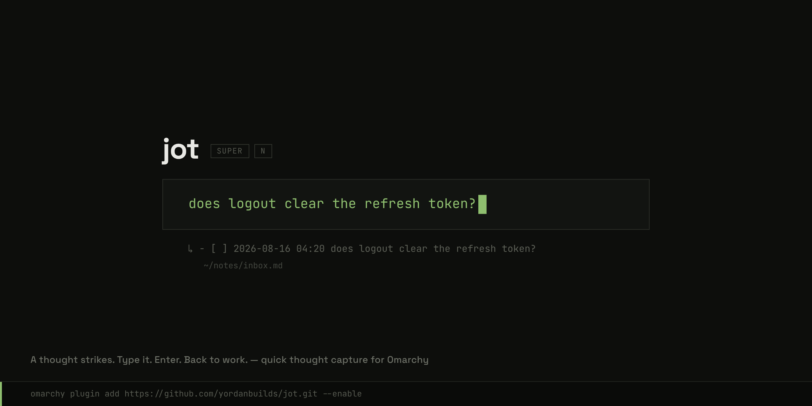

# Jot

**A thought strikes. Type it. Enter. Back to work.**

A minimal overlay with one text field. Whatever you type is appended as a
timestamped `- [ ]` line to `~/notes/inbox.md`, and the overlay is gone.
Capturing and organizing are separate moments: Jot owns the capture; you own the rest.

## Installation

Jot needs [Omarchy](https://omarchy.org) 4 or newer.

    omarchy plugin add https://github.com/yordanbuilds/jot.git --enable

On first load, Jot sets itself up:

- **Jot** appears in the Omarchy menu, under _Trigger_ — Jot down and Open inbox
- `~/.config/jot/config.json` is created with the defaults

Your keys stay yours: Jot binds nothing on its own. While no shortcut
exists, the _Jot_ menu carries one more row — **Add SUPER+N shortcut** —
and picking it writes the binding. Once the shortcut exists the row is
gone, having nothing left to offer. If <kbd>SUPER</kbd>+<kbd>N</kbd>
already belongs to something else, Jot says so and takes nothing.

Away from the menu, the same row is a script:

    ~/.config/omarchy/plugins/yordanbuilds.jot/bin/jot-bind-key

Prefer another key? Write it yourself in `~/.config/hypr/bindings.lua`:

    o.bind("SUPER + SHIFT + N", "Jot", "omarchy-shell shell toggle yordanbuilds.jot '{}'")

Everything Jot adds is marked and yours — edit or remove any of it, and
Jot won't put it back.

## Usage

| Key                                     | What happens                          |
| --------------------------------------- | ------------------------------------- |
| <kbd>SUPER</kbd>+<kbd>N</kbd>           | Open the overlay, once you add it     |
| type                                    | Compose the thought                   |
| <kbd>Shift</kbd>+<kbd>Enter</kbd>       | New line — the thought stays one item |
| <kbd>Enter</kbd>                        | Append to the inbox and close         |
| <kbd>Esc</kbd> / empty <kbd>Enter</kbd> | Close without saving                  |
| click outside the card                  | Close without saving                  |

Multi-line thoughts land as one markdown todo with indented continuation
lines:

    - [ ] 2026-08-16 14:32 does logout clear the refresh token?
      check SessionGuard, and the mobile client too

## Configuration

`~/.config/jot/config.json`:

    {
      "file": "~/notes/inbox.md",
      "template": "- [ ] %Y-%m-%d %H:%M {text}"
    }

`file` is where captures land (created on first capture).

`template` is the line format: `{text}` is your thought; everything else goes through
`date(1)`, so any strftime code works — or delete the codes for no
timestamp at all.

## Uninstall

    ~/.config/omarchy/plugins/yordanbuilds.jot/bin/jot-uninstall
    omarchy plugin remove yordanbuilds.jot

The first command removes the menu entries and the keybinding if you added
one, then asks about `~/.config/jot` (`--purge` skips the question). Your
notes file is never touched.

## License

Jot is open-source software licensed under the [MIT license](LICENSE).
